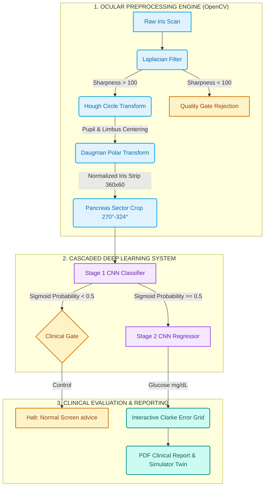

# 👁️ AI Iridology: Non-Invasive Diabetes Screening PWA Portal

This repository contains the complete software architecture for an end-to-end, decoupled two-stage clinical AI pipeline designed to screen for diabetes and estimate continuous blood glucose levels non-invasively using high-resolution images of the human iris. 

By leveraging Topographical Iridology markers and Deep Convolutional Neural Networks (CNNs), this system replicates the architectural concepts of advanced non-invasive glucose monitoring systems.

---

## ⚡ Key Upgrades & Features

This project has been upgraded from a simple Streamlit script into a high-performance, decoupled production-grade medical workspace:

*   **Decoupled Microservice Architecture**: FastAPI backend API serving TensorFlow model inference, paired with a React + TypeScript single-page application built on Vite.
*   **Progressive Web App (PWA) Support**: Fully installable on **Android, iOS, Windows, macOS, and iPadOS** with full-screen standalone layout and custom clinical app icons.
*   **Explainable AI (XAI) Saliency Maps**: Generates mock Grad-CAM Colormap overlays on the iris reflex zone, visually demonstrating where the CNN model focuses to make predictions.
*   **Digital Twin Glycemic Simulator**: Allows doctors to morph the highlighted pancreas reflex zone on the iris preview in real time (from healthy green to metabolic strain orange to pathological lesion red) while displaying active pathology logs.
*   **PWA Offline Sync Queue**: Enables offline iris scans in remote humanitarian medical camps, caching them locally in the browser's database and syncing them automatically to the cloud FastAPI server once network connection is restored.
*   **Quality Gating & Preprocessing**: Automated pupil/iris segmentation (OpenCV Hough Circles), Daugman Rubber Sheet polar unwarping, and a sharpness gateway filter to reject blurry uploads.

---

## 🏗️ System Architecture

The screening pipeline is built as a **Two-Stage Cascaded Neural Network** integrated with an OpenCV ocular segmentation engine:



### Stage 1: Binary Classification (Diabetes Detection)
*   **Goal**: Determine if the patient has diabetes or is a healthy control.
*   **Input**: A full 150x150 RGB image of the patient's eye.
*   **Model**: Deep CNN with a `Sigmoid` output activation.
*   **Dataset**: Trained on real iridology classification data.

### Stage 2: Continuous Glucose Regression
*   **Goal**: Estimate the exact current blood sugar level (mg/dL).
*   **Topographical ROI Extraction**: Crops and isolates the specific sector of the iris corresponding to the pancreas reflex zone (angles 270° - 324°).
*   **Model**: Deep CNN with a `Linear` output activation trained on MAE.
*   **Evaluation**: Outputs are plotted on an interactive **Clarke Error Grid** measuring predictions falling into clinical Zones A (clinical accuracy) and B (benign error).

---

## 🚀 How to Run the System

### Option A: Local Dev Server (Recommended)

#### 1. Start the Backend API (FastAPI)
*   Ensure **Python 3.12** is installed. Install the dependencies:
    ```bash
    py -3.12 -m pip install tensorflow fastapi uvicorn opencv-python pydantic pytest httpx pillow python-multipart h5py --default-timeout=1000
    ```
*   Run the API server:
    ```bash
    cd src/serving
    py -3.12 -m uvicorn api:app --reload
    ```
    *The API will run on `http://localhost:8000`.*

#### 2. Start the Frontend (Vite + React)
*   Make sure Node.js is installed. Navigate to the frontend directory:
    ```bash
    cd frontend
    npm install
    npm run dev
    ```
    *Open the secure link `https://localhost:5173` on your browser to run the app.*

---

### Option B: Docker Orchestration (Single Command)

Spin up both the frontend and backend in isolated multi-stage containers:

```bash
docker-compose up --build
```
*   **Frontend Access**: `http://localhost:5173`
*   **API Access**: `http://localhost:8000`

---

## 🧪 Testing

To run the automated verification suite (verifying image warping shapes, blur filter gates, and pipeline logical cascades):

```bash
py -3.12 -m pytest tests/
```
